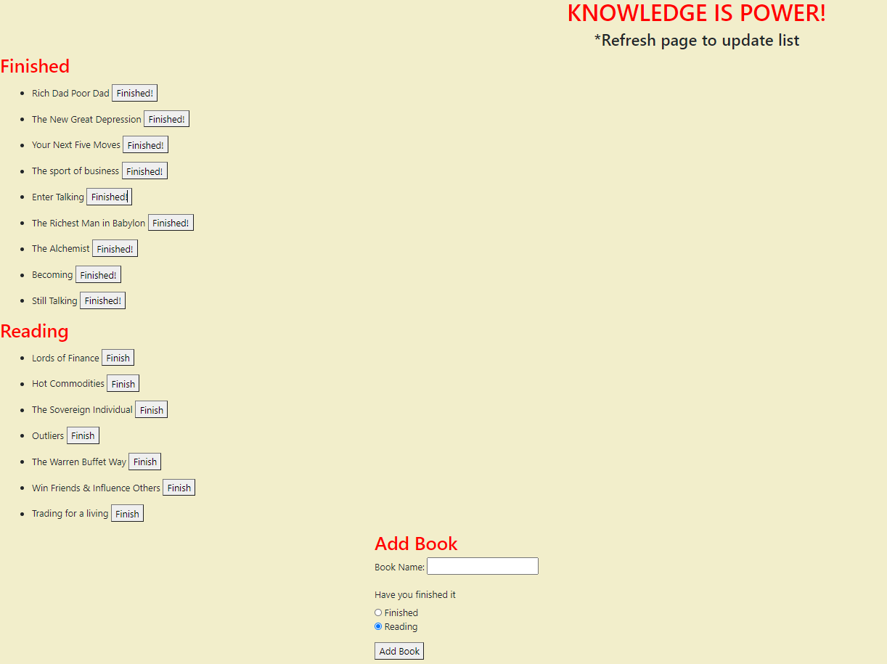

# my-book-list
Architect and build a solution for managing a company's employees using node, inquirer, and MySQL.

<br>

==========




## Update table

```
 update: function(table, objColVals, condition, cb) {
    var queryString = "UPDATE " + table;

    queryString += " SET ";
    queryString += objToSql(objColVals);
    queryString += " WHERE ";
    queryString += condition;

    console.log(queryString);
    connection.query(queryString, function(err, result) {
      if (err) {
        throw err;
      }

      cb(result);
    });
  },
```
<br>

## Add Get Routes

```
router.get("/", function(req, res) {
  book.all(function(data) {
    var hbsObject = {
        // connect to table
      bookList: data
    };
    console.log(hbsObject);
    res.render("index", hbsObject);
  });
});
```
<br>

## View existing tables

```
function viewEmployees() {
    connection.query("SELECT * FROM employees", function (err, res) {
        if (err) throw err;
        console.table(res);
        manageEmployees()
 })};
```

<br>

## Built With

* [Javascript](https://developer.mozilla.org/en-US/docs/Web/JavaScript)
* [Node](https://nodejs.org/en/)
* [Mysql](https://www.mysql.com/)


## Deployed Link

* [See Walk Through](https://drive.google.com/file/d/1EBszgNwq7ELFLu8ChNjBIlKkee-Gg-7_/view)

## License

This project is licensed under the MIT License 

## Prerequisites

Git hub,
Git lab,
Git bash,
Visual studio,
Google chrome,
Bootstrap,
JavaScript
Node
mysql
## Authors

**Jasmine Franklin C: 301-332-2313 E: jasminer.franklin@gmail** 

- [Link to Portfolio Site](https://jas-f.github.io/responsive-portfolio/)
- [Link to Github](https://github.com/)
- [Link to LinkedIn](https://www.linkedin.com/in/jasmine-franklin-8b08ba121)

<p>&copy; UC Berkeley Extension Bootcamp.</p>

